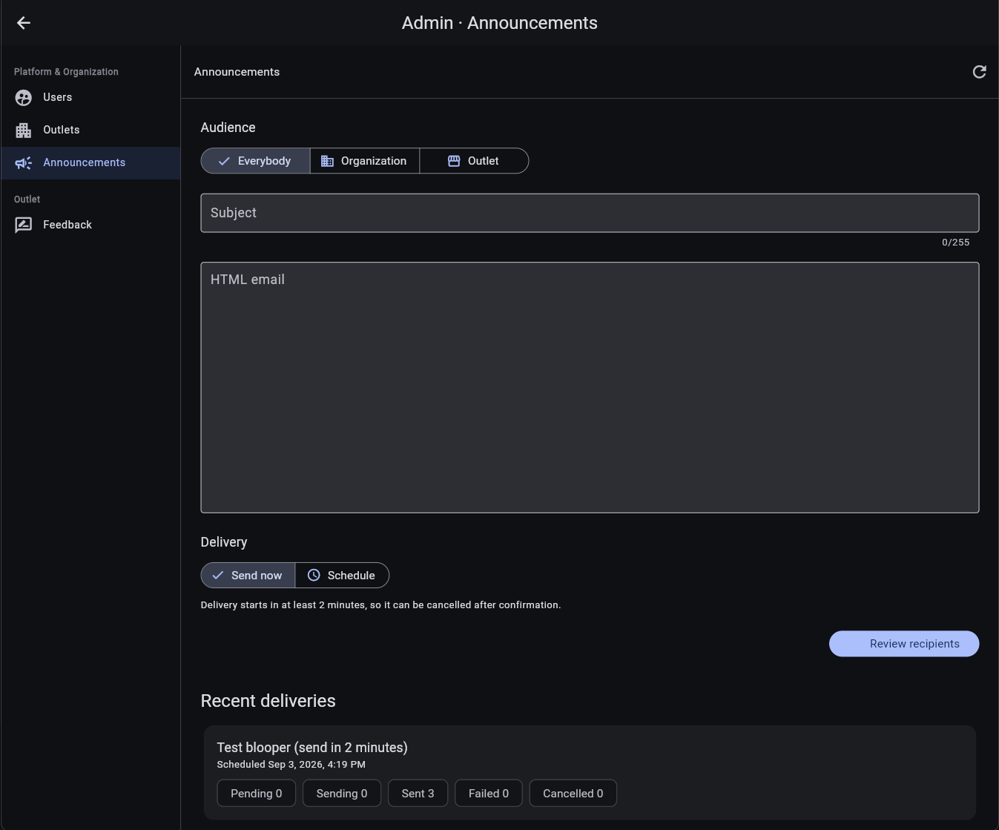

# Send announcements

Use **Admin > Announcements** to send an HTML email to all active users, one organization, or one outlet. This page is available to platform administrators.

## Compose an announcement

1. Choose an **Audience**:
   - **Everybody** includes all active users.
   - **Organization** requires one organization.
   - **Outlet** requires an organization and one of its outlets.
2. Enter a subject of no more than 255 characters.
3. Enter the email body as HTML. The field does not convert Markdown to HTML.
4. Choose **Send now** or **Schedule**.
5. Select **Review recipients**.

For a scheduled delivery, select a future date and time. **Send now** still starts at least two minutes after confirmation, leaving a short cancellation window.

## Review and confirm

The recipient review is the final safety check before an announcement is queued.

1. Check the recipient count.
2. Review the names and email addresses in the paginated list.
3. Select **Back** to adjust the audience, or **Confirm send** / **Confirm schedule** to queue the delivery.

Discover confirms the number of queued emails and the scheduled delivery time. Recipient review is especially important for **Everybody**, because that audience is platform-wide.

## Monitor recent deliveries

Each item under **Recent deliveries** shows its subject, scheduled time, and delivery counts:

- **Pending** has not started.
- **Sending** is currently in progress.
- **Sent** completed successfully.
- **Failed** encountered a delivery error.
- **Cancelled** was stopped before sending.

When pending emails remain, select **Cancel**, review the confirmation, and choose **Cancel emails**. Cancellation affects pending emails only; messages already sent cannot be recalled.

[Back to administration overview](admin.md)
