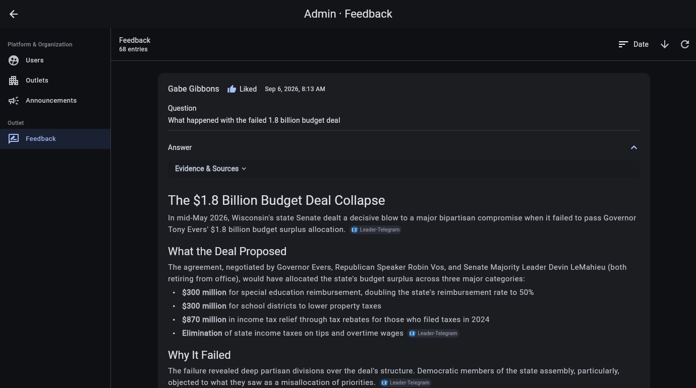

# Review feedback

Use **Admin > Feedback** to inspect the positive and negative ratings users submit on Discover responses. Platform, organization, and outlet administrators can open this page; the entries returned depend on their access.

## Find useful entries

The header shows the number of available feedback entries. Use the sort control to organize them by:

- **Date** for the newest or oldest submissions.
- **Author** for alphabetical review by user.
- **Liked / Disliked** to group ratings.

Select the arrow beside the sort control to reverse the current order. Select **Refresh** to load newly submitted feedback.

## Review an entry

Each feedback card can include:

- the user's name, rating, and submission time;
- an optional reason supplied by the user;
- the exact question that produced the response; and
- the answer, including its structured evidence and sources.

Select the chevron on **Answer** to expand or collapse the response. Feedback is read-only in this workspace, so use it as evidence for follow-up with users, content review, or configuration changes in the relevant outlet.

If no entries are available, the page displays **No feedback has been submitted.**

[Back to administration overview](admin.md)
