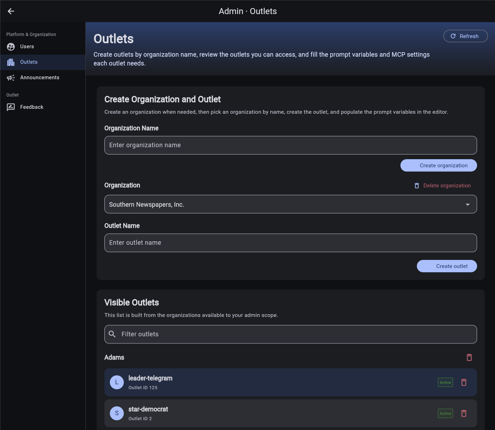
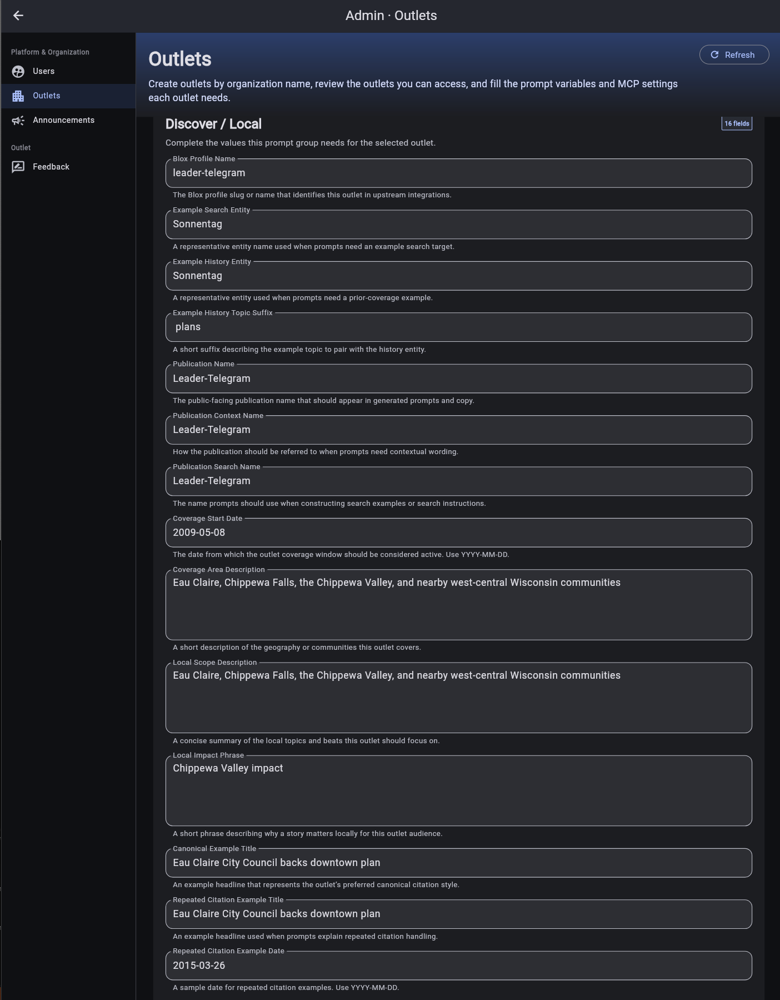
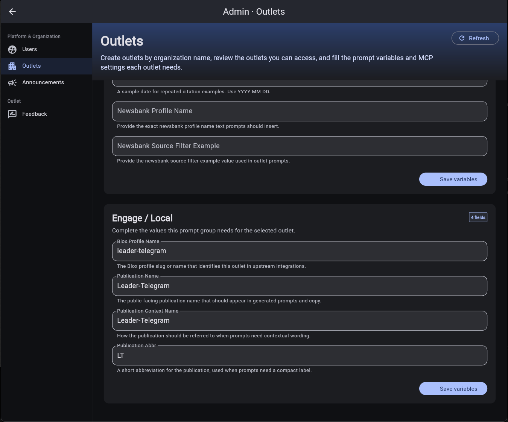
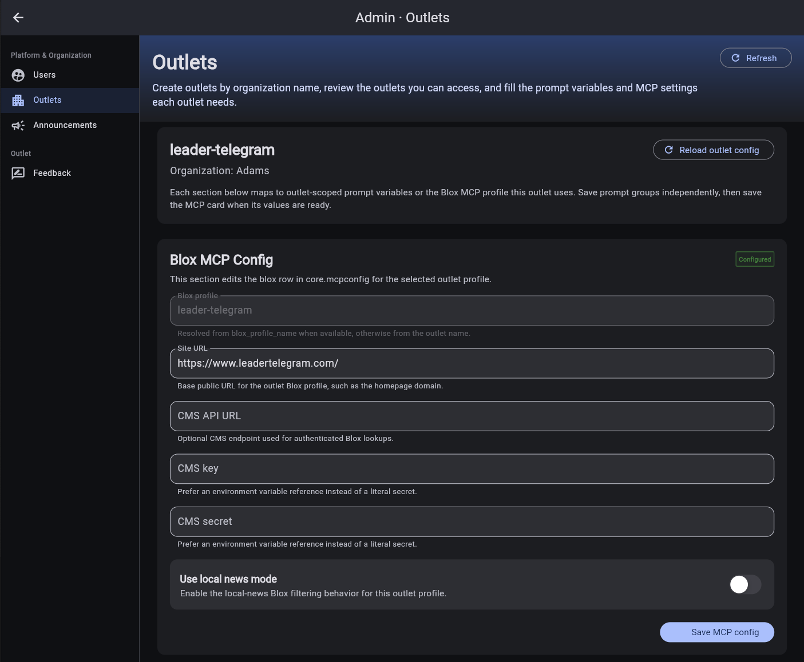
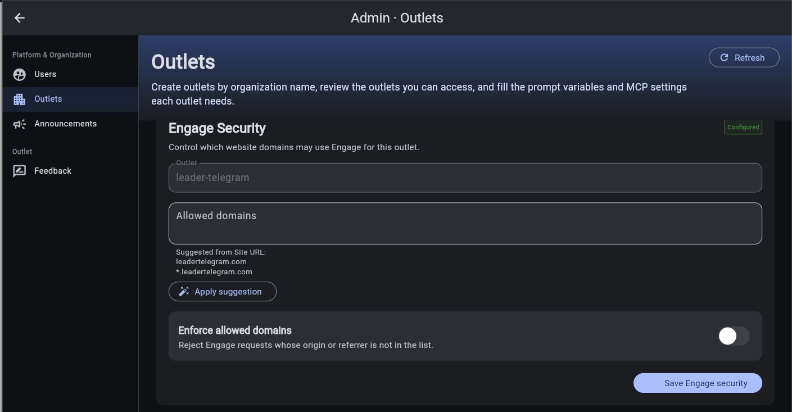

# Manage organizations and outlets

Use **Admin > Outlets** to maintain the organization hierarchy and the configuration Discover and Engage use for each outlet.

The page requires outlet-management access. Editing prompt variables, Blox settings, or Engage security also requires assistant-configuration access. If you can open the page but the settings are read-only, ask a platform administrator to review that permission.

## Create or select an outlet



1. To add an organization, enter **Organization Name** and select **Create organization**.
2. Select an organization from the **Organization** list.
3. To add an outlet, enter **Outlet Name** and select **Create outlet**.
4. Under **Visible Outlets**, filter the list if needed and select the outlet to configure.

New organizations and outlets are selected automatically after creation. **Refresh** reloads the organization and outlet lists.

### Delete records carefully

- An organization can be deleted only when it has no outlets and no organization role assignments.
- An outlet can be deleted only when no users, role assignments, or projects reference it.

Both actions require confirmation. Resolve dependencies instead of deleting active records merely to rename or reorganize them.

## Configure an outlet

After you select an outlet, its prompt-variable groups, Blox MCP configuration, and Engage security configuration load together. **Reload outlet config** discards unsaved field changes and reloads the saved values.

For a new outlet, use this order:

1. Complete and save each prompt-variable group.
2. Verify the resolved Blox profile and save the Blox MCP configuration.
3. Add allowed Engage domains, then enable enforcement when the list is ready.

## Complete prompt variables

Prompt variables insert outlet-specific language and examples into Discover and Engage instructions. Groups are saved independently, so select **Save variables** in every group you change.



The **Discover / Local** group includes the Blox profile, publication naming, archive coverage, local geography and focus, sample search entities, and citation examples. Complete values with real outlet terminology. Enter dates as `YYYY-MM-DD`.



The **Engage / Local** group supplies the profile and publication names used in public-facing responses. Keep `blox_profile_name` consistent anywhere it appears. Conflicting profile values prevent the Blox configuration from resolving.

## Configure Blox MCP

The Blox MCP section connects the selected outlet profile to its public site and, when used, its authenticated CMS endpoint.



1. Confirm **Blox profile**. It resolves from `blox_profile_name`, with the outlet name as a fallback.
2. Enter the public homepage in **Site URL**.
3. If authenticated Blox lookups are enabled, enter **CMS API URL**.
4. Supply **CMS key** and **CMS secret** as environment variable references provided by your deployment administrator.
5. Enable **Use local news mode** when this profile should apply local-news filtering.
6. Select **Save MCP config** and confirm the status changes to **Configured**.

Stored CMS credentials are hidden. Leave a credential field blank to preserve its existing value; enter a value only to replace it. Additional configuration properties that are not shown in the form are preserved when you save.

## Configure Engage security

Engage security controls which website domains may embed or call Engage for the selected outlet.



1. Verify the read-only **Outlet** profile.
2. Enter allowed domains separated by commas, spaces, or new lines.
3. When a **Site URL** is available, select **Apply suggestion** to add the base domain and its wildcard subdomains.
4. Review the list before enabling **Enforce allowed domains**.
5. Select **Save Engage security**.

A typical allowlist contains both forms:

```text
example.com
*.example.com
```

When enforcement is on, Engage rejects requests whose origin or referrer is not in the allowlist. Keep enforcement off until every production and approved preview domain is represented.

[Back to administration overview](admin.md)
