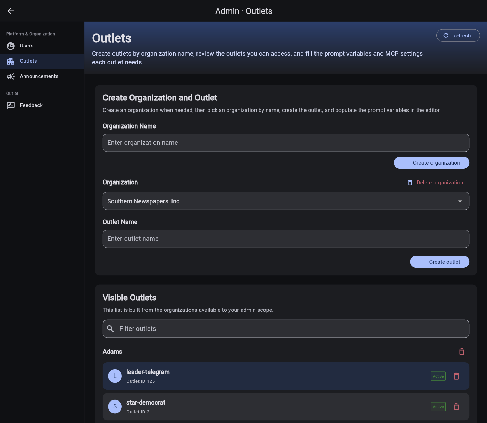
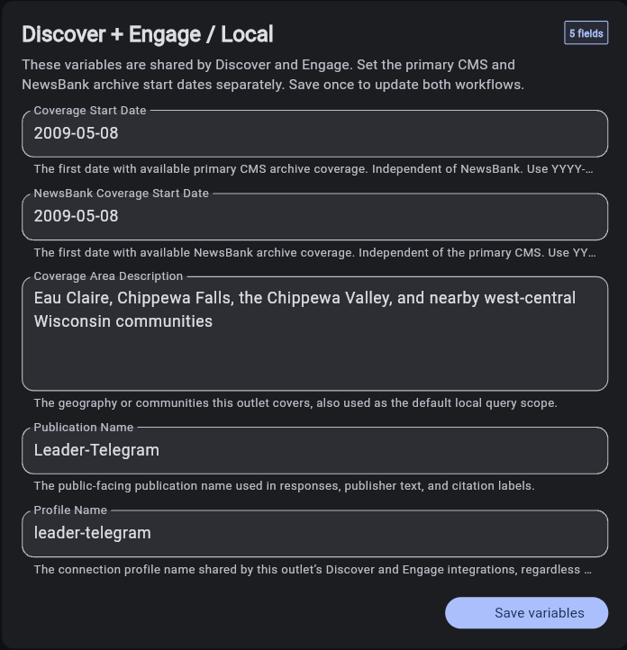
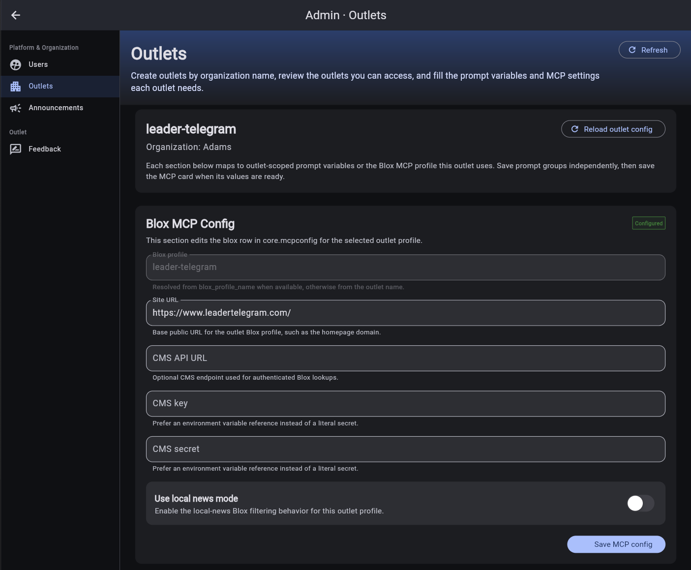
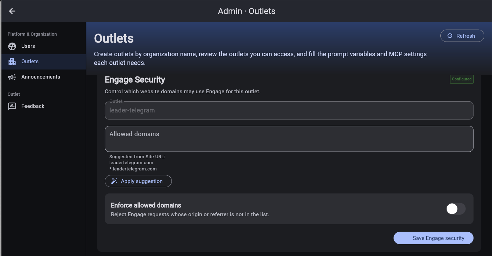

# Manage organizations and outlets

Use **Admin > Outlets** to maintain the organization hierarchy and the configuration Discover and Engage use for each outlet.

The page requires outlet-management access. Editing prompt variables, CMS connection settings, or Engage security also requires assistant-configuration access. If you can open the page but the settings are read-only, ask a platform administrator to review that permission.

## Create or select an outlet



1. To add an organization, enter **Organization Name** and select **Create organization**.
2. Select an organization from the **Organization** list.
3. To add an outlet, enter **Outlet Name** and select **Create outlet**.
4. Under **Visible Outlets**, filter the list if needed and select the outlet to configure.

New organizations and outlets are selected automatically after creation. **Refresh** reloads the organization and outlet lists.

### Delete records carefully

- An organization can be deleted only when it has no outlets and no organization role assignments.
- An outlet can be deleted only when no users, role assignments, or projects reference it.

Both actions require confirmation. Resolve dependencies instead of deleting active records merely to rename or reorganize them.

## Configure an outlet

After you select an outlet, its prompt-variable groups, CMS connection configuration, and Engage security configuration load together. The outlet variables appear first, followed by connection settings and Engage security. **Reload outlet config** discards unsaved field changes and reloads the saved values.

For a new outlet, use this order:

1. Complete and save the shared **Discover + Engage / Local** variables and any other required prompt-variable groups.
2. Verify the resolved outlet profile and save the CMS connection configuration.
3. Add allowed Engage domains, then enable enforcement when the list is ready.

## Complete prompt variables

Outlet variables supply publication identity, archive coverage, and the connection profile. This section is provider-neutral: use the same variable names whether the selected archive provider is BLOX, NewsBank, or another supported integration.

**Discover + Engage / Local** is one shared editor for both workflows. It contains five variables:



The screenshot shows matching archive dates, but the fields are independent. Enter
each provider's actual coverage start date; they do not need to match.

| UI field | Variable | What to enter |
|---|---|---|
| **Coverage Start Date** | `coverage_start_date` | First date with available primary CMS archive coverage, as `YYYY-MM-DD`. |
| **NewsBank Coverage Start Date** | `newsbank_coverage_start_date` | Independent first date with available NewsBank archive coverage, as `YYYY-MM-DD`. |
| **Coverage Area Description** | `coverage_area_description` | Geography and communities covered; also the default scope for local questions. |
| **Publication Name** | `publication_name` | Public-facing publication name, used for responses, publisher text, and citation labels. |
| **Profile Name** | `profile_name` | Exact connection profile name supplied by the deployment administrator, regardless of provider. |

For example:

```json
{
  "coverage_start_date": "2004-12-08",
  "newsbank_coverage_start_date": "1990-01-01",
  "coverage_area_description": "Easton, Talbot County, and nearby counties on Maryland's Eastern Shore",
  "publication_name": "The Star Democrat",
  "profile_name": "star-democrat"
}
```

Select **Save variables** once to update Discover and Engage together. Publication identity, coverage geography, and profile name are shared. The two archive dates are independent: primary CMS prompts use **Coverage Start Date**, while NewsBank prompts use **NewsBank Coverage Start Date**. Changing either date does not change the other. A valid NewsBank date is required before starting a NewsBank workflow; do not assume its archive begins at the same time as the primary CMS.

Other prompt-variable groups remain separate. When legacy Discover/Engage values conflict, the editor uses the non-empty Discover value; Engage supplies values missing from Discover. Saving writes the selected values to both workflows. If the outlet uses more than one CMS provider, the profile name must match each provider's authorized configuration.

Search and citation examples are shared fictional prompt text, not outlet fields. You do not need publication aliases, a separate citation abbreviation, local example entities or headlines, a local-impact phrase, or provider-specific profile variables. NewsBank's source-filter example is included in the prompt to teach syntax; its fictional source names must not be used for a real search.

If older fields or separate local editors still appear, ask the deployment administrator to deploy the shared-editor update, apply the outlet-variable migration, and refresh the page. The migration initializes the NewsBank date once from the previously shared date when no NewsBank-specific value exists. Verify it against the actual NewsBank archive; later changes remain independent. Do not fill deprecated fields to work around an outdated configuration.

Project prompt choices must also match their source connections. See [Prompt Subtypes and Flavors](discover-prompt-options.md#connected-tools-and-configuration) for CMS archive, NewsBank, international, and Deep Search requirements.

## Configure the CMS connection

The CMS connection settings connect the selected outlet profile to its public site and, when used, its authenticated CMS endpoint. The current **Blox MCP Config** card edits the BLOX integration only; it is separate from the provider-neutral outlet variables and does not configure NewsBank or other providers.



1. Confirm the connection profile matches the intended outlet.
2. Enter the public homepage in **Site URL**.
3. If authenticated CMS lookups are enabled, enter **CMS API URL**.
4. Supply **CMS key** and **CMS secret** as environment variable references provided by your deployment administrator.
5. Enable **Use local news mode** when this profile should apply local-news filtering.
6. Select **Save MCP config** and confirm the status changes to **Configured**.

Stored CMS credentials are hidden. Leave a credential field blank to preserve its existing value; enter a value only to replace it. Additional configuration properties that are not shown in the form are preserved when you save.

## Configure Engage security

Engage security controls which website domains may embed or call Engage for the selected outlet.



1. Verify the read-only **Outlet** profile.
2. Enter allowed domains separated by commas, spaces, or new lines.
3. When a **Site URL** is available, select **Apply suggestion** to add the base domain and its wildcard subdomains.
4. Review the list before enabling **Enforce allowed domains**.
5. Select **Save Engage security**.

A typical allowlist contains both forms:

```text
example.com
*.example.com
```

When enforcement is on, Engage rejects requests whose origin or referrer is not in the allowlist. Keep enforcement off until every production and approved preview domain is represented.

[Back to administration overview](admin.md)
