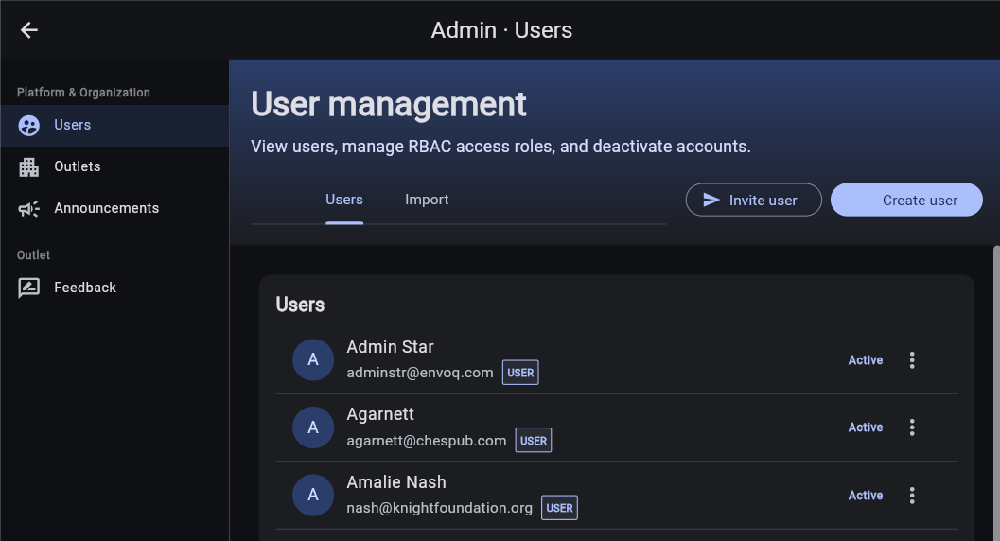

# Onboard a new user

Use this guide to invite a newsroom user, give them access to the correct outlet, and prepare their first Discover project. **Invite user** is the recommended flow: the user sets their own password rather than receiving one from an administrator.

For the complete role and account-action reference, see [Manage users](admin-users.md).

## 1. Prepare the user's access

Before sending an invitation, confirm:

- the user's name and sign-in email address;
- the organization and outlet they should work in;
- the narrowest role that supports their responsibilities; and
- whether they need a new starter project or access to an existing project.

The outlet must already exist. If it is not ready, follow [Launch a new outlet](admin-outlet-launch-checklist.md) first.

For a reporter, editor, or researcher who needs a personal Discover workspace, use **Outlet User**. Do not grant an administrator role just to provide research access. See [Choose a role](admin-users.md#choose-a-role) for administrator and read-only roles.

## 2. Invite the user

1. In Discover, open the avatar/user menu in the upper-right corner.
2. Select **Admin**, then **Users**.
3. Select **Invite user**.
4. Choose **Outlet User** under **Access role**.
5. Enter the user's **Name** and **Email**.
6. Select the correct publication under **Outlet**.
7. Enable **Create project** when the user needs a starter workspace.
8. With project creation enabled, set **Prompt flavor** to **Deep Archive Search** for the archive-research onboarding workflow.
9. Review the email address, role, outlet, and project settings.
10. Select **Send invite**.

Repeat these steps for each user. **Create project** is available only for **Outlet User** assignments. If the person will use an existing shared project instead, leave it off and arrange project membership separately.

If the form displays an error, correct the reported problem and submit again. Invitation and account-creation errors appear as red text at the top of the dialog and remain until the next submission.

## 3. Confirm account activation

1. Find the account on the **Users** tab and confirm its status is **Pending**.
2. Ask the user to open the invitation email and follow its instructions to set a password.
3. Ask them to sign in using the invited email address.
4. Check that the account becomes **Active**.

The invitation does not complete onboarding by itself. Confirm that the user can actually sign in and open the intended workspace.

If no email arrives, have the user check spam and filtered-mail folders, verify the address on the account, then use the user's three-dot menu to select **Resend invitation** while the account is pending.

## 4. Confirm project access

Have the user open their starter project, or have a project owner share the existing workspace with them.

Outlet role assignments and project membership are separate: access to an outlet does not automatically grant access to every project in that outlet. If the project is missing, check both the outlet assignment under **Manage access** and membership in the intended project.

After changing access, ask the user to sign out and back in. See [Projects and collaboration](discover-projects.md) for creating and sharing workspaces.

## 5. Walk through the first research session

Give the user a short introduction in their own project:

1. Start a **New Discussion** for a familiar local topic.
2. Ask a specific question with a person, place, or organization and a time range.
3. Open **Evidence & Sources** and review the references and search trail.
4. Open a cited article and confirm it supports the answer.
5. Ask a follow-up question in the same discussion.
6. Start a new discussion before switching to a different topic.

For example:

> What has the city council decided about water rates since 2020? List the key votes and link to the reporting that supports each one.

Remind the user that generated answers are research assistance, not a substitute for checking original reporting. Archive coverage may be incomplete; a fluent answer is not proof that every relevant article was found.

Share these guides:

- [Getting started with Discover](discover-getting-started.md) for writing questions and keeping discussions focused.
- [Interface guide](discover-interface.md) for navigation and user controls.
- [Evidence and response tools](discover-research-trails.md) for checking sources and working with answers.
- [Deep Archive Search](discover-local-two-step-journalist-guide.md) for the archive-research workflow.
- [Profile, password, and account access](account-and-password.md) for account self-service.

## Alternative: create an account with a password

Use **Create user** only when an account must be active immediately with an administrator-provided initial password.

Follow the same role, identity, outlet, and project choices as the invitation flow, but enter a password before confirming account creation. The password must contain:

- at least 8 characters;
- an uppercase letter and a lowercase letter;
- a number; and
- one of `@ # $ % ^ & + = !`, with no whitespace.

The rules appear below the password field. Invalid passwords prevent submission; correct any validation error shown in the dialog.

A directly created account is **Active** immediately. Share the initial password only through your organization's approved secure channel, and have the user follow [Change your password while signed in](account-and-password.md#change-your-password-while-signed-in).

## Alternative: onboard several users

Use **Admin > Users > Import** for a UTF-8 CSV upload. Review role and outlet scope for every row, keep **Send invite emails (default)** enabled for normal invitation onboarding, and use `createProject=true` only for `outlet_user` rows that need a starter project.

See [Import users from CSV](admin-users.md#import-users-from-csv) for the exact columns, row overrides, and result handling. Do not assume that a successful upload means every row succeeded: review line-specific errors and re-import only failed rows after correcting them.

## Resolve common onboarding problems

| Problem | Administrator action |
| --- | --- |
| **Admin**, a role, or an outlet is missing | Ask a platform administrator to check your administrative scope. |
| Invitation email does not arrive | Verify the email address, check filtered-mail folders, and resend the pending invitation. |
| Email is already registered | Find the existing account and review its status and access instead of creating a duplicate. |
| Account remains **Pending** | Ask the user to complete the invitation flow; resend the invitation if needed. |
| Account is **Disabled** | Use **Activate** when restoring access is authorized. |
| Active user cannot remember the password | Use **Send password reset**, or direct them to **Forgot password?** on the login page. |
| User can sign in but cannot see the project | Check outlet role scope and project membership, then have them sign out and back in. |
| Project opens but archive results are missing or from the wrong outlet | Review the project's configuration and the outlet's prompt variables and Blox MCP configuration using [Organizations and outlets](admin-outlets.md). |

Never ask users to send you their password, invitation token, or reset token.

## Onboarding completion checklist

- [ ] The account uses the correct name and email address.
- [ ] The role and outlet scope match the user's responsibilities.
- [ ] The user has completed activation and the account is **Active**.
- [ ] The user can sign in and open the intended project.
- [ ] The archive-research starter project uses **Deep Archive Search**, when applicable.
- [ ] The user has asked a first question and opened a supporting source.
- [ ] The user knows to start a new discussion for a new topic.
- [ ] The user has the help links and knows whom to contact for access problems.

[Back to administration overview](admin.md)
