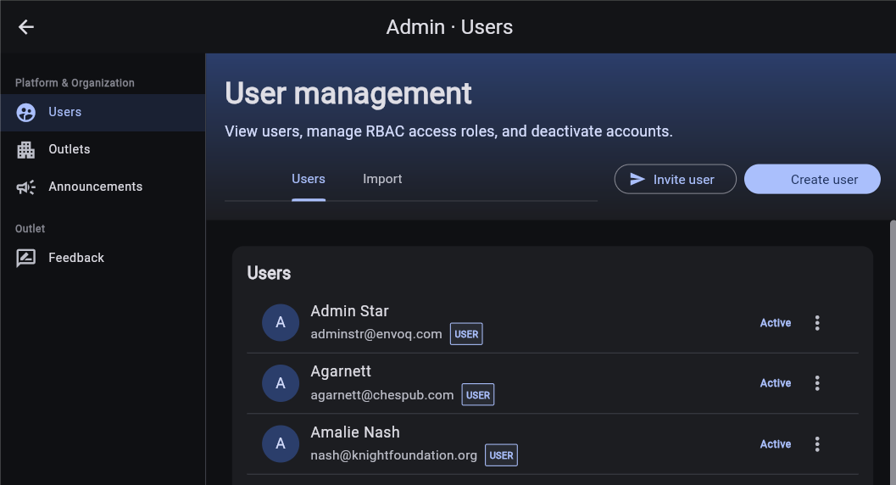
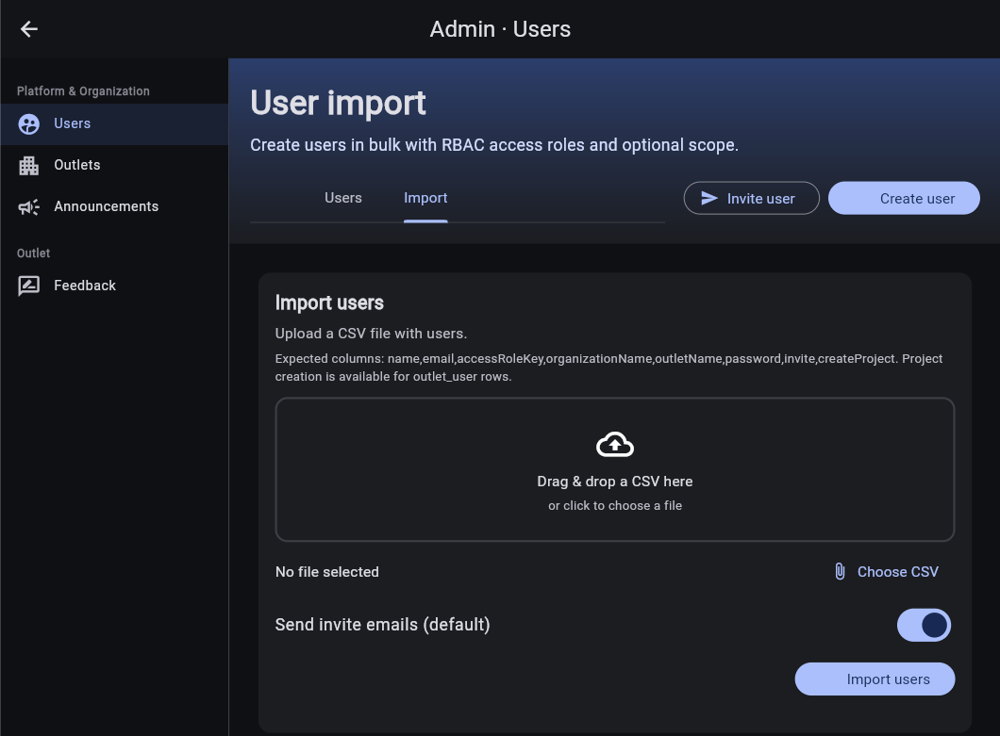

# Manage users

Use **Admin > Users** to control accounts and role assignments. The page lists non-system users alphabetically and shows each account's primary role and status.



## Account status

| Status | Meaning |
| --- | --- |
| **Pending** | An invitation was sent, but the user has not activated the account. |
| **Active** | The account can sign in. |
| **Disabled** | The account cannot sign in until an administrator activates it. |

## Invite or create one user

Use **Invite user** for the normal onboarding flow. Use **Create user** only when the account must be active immediately with an administrator-provided initial password.

1. Select **Invite user** or **Create user**.
2. Choose an **Access Role**.
3. Enter the user's name and email address.
4. For **Create user**, enter an initial password and share it through your organization's approved secure channel.
5. Select the organization or outlet required by the role.
6. For an **Outlet User**, optionally enable **Create project** to provision a starter project for that person.
7. Confirm the action.

An invited user remains **Pending** until they follow the email invitation and set a password. A directly created user is **Active** immediately.

## Choose a role

| Role | Scope | Intended access |
| --- | --- | --- |
| **Platform Admin** | Platform | Global administration across all organizations and outlets. |
| **Organization Admin** | Organization, optionally narrowed to an outlet | Manage users and projects for one organization. |
| **Organization Viewer** | Organization, optionally narrowed to an outlet | Read-only access within one organization. |
| **Outlet Admin** | Outlet | Manage users and projects for one outlet. |
| **Outlet Viewer** | Outlet | Read-only access to one outlet. |
| **Outlet User** | Outlet | Standard project access for one outlet. |

Only roles within your own administrative scope appear in the form. The **Create project** option is valid only for **Outlet User** assignments.

## Manage access

Open the three-dot menu on a user row to see the actions available to your account.

- **Edit name and email** changes the user's identity details without changing access.
- **Manage access** lists all role assignments. Add a role with its required organization or outlet, or remove an assignment that is no longer needed.
- **Resend invitation** sends a new invitation to a pending user.
- **Send password reset** asks an active user to set a new password.
- **Disable** prevents a user from signing in. You cannot disable your own account.
- **Activate** restores a disabled account.
- **Copy ID, name, email** copies a compact account reference to the clipboard.

Available actions vary by permission and account status.

## Import users from CSV

Open the **Import** tab to create multiple accounts from one UTF-8 CSV file. Drag the file into the upload area or select **Choose CSV**.



Use this header row:

```csv
name,email,accessRoleKey,organizationName,outletName,password,invite,createProject
```

| Column | Value |
| --- | --- |
| `name` | Display name. If blank, Discover derives a name from the email address. |
| `email` | Required, unique email address. |
| `accessRoleKey` | `platform_admin`, `organization_admin`, `organization_viewer`, `outlet_admin`, `outlet_viewer`, or `outlet_user`. |
| `organizationName` | Existing organization name. Required when the selected role or outlet needs an organization. |
| `outletName` | Existing outlet name within `organizationName`. Required for outlet-scoped roles. |
| `password` | Initial password for a directly created account. Leave blank for an invitation. |
| `invite` | Optional row override: `true` or `false`. Also accepts `yes`/`no`, `1`/`0`, and `y`/`n`. |
| `createProject` | Optional boolean. Use `true` only with `outlet_user` and a valid outlet. |

The **Send invite emails (default)** switch supplies the default for rows where `invite` is blank. A row is still invited if its password is blank, even when `invite` is `false`.

Select **Import users** once. After processing, Discover reports the total rows, directly created accounts, invitations, and line-specific errors. Correct failed rows and import only those rows again to avoid duplicate-email errors.

[Back to administration overview](admin.md)
