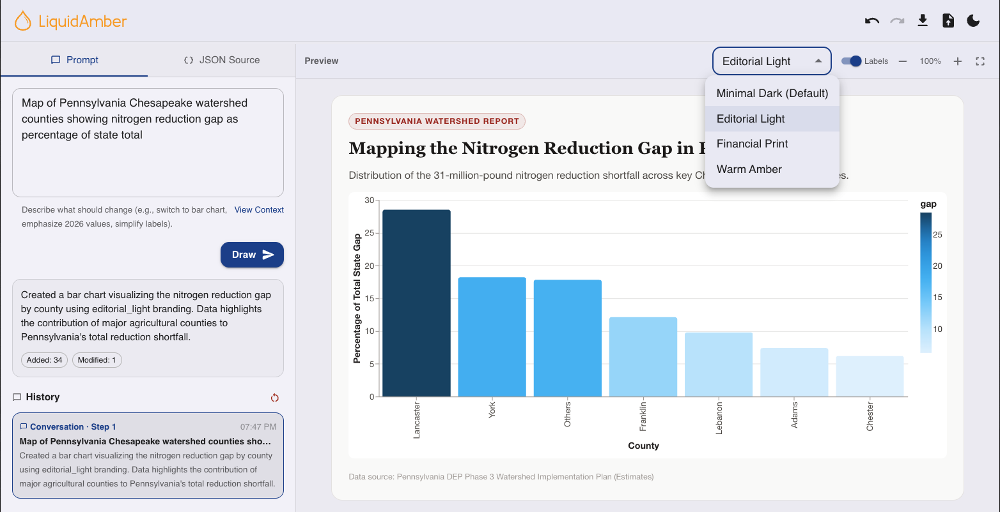
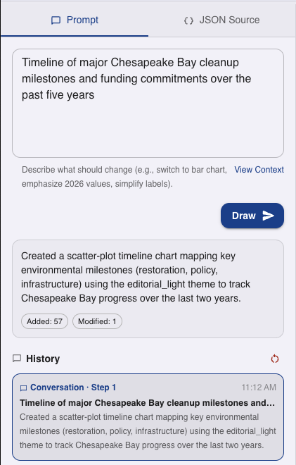
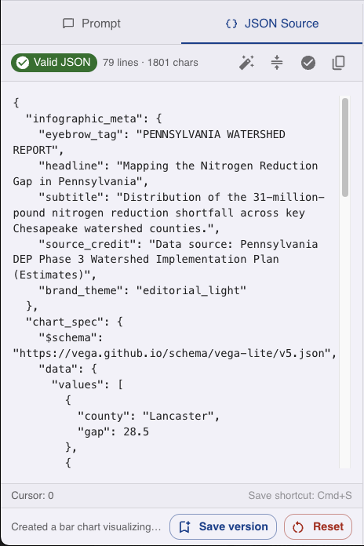
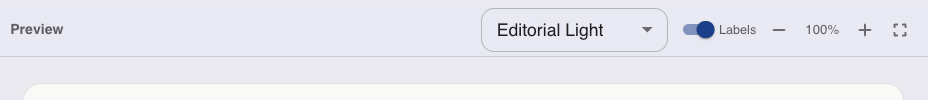
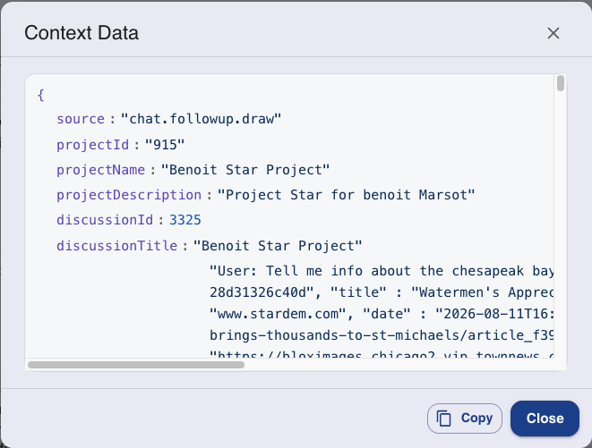

# Describe

# Hello Benoit!

## Overview

LiquidAmber Describe turns research findings into branded charts and graphics that publishers can use to explain complex topics more clearly. You describe what you want in plain language, Describe generates a chart, and you can keep refining it — by prompt or by editing the underlying spec directly — until it's ready to publish.

*Screenshot placeholder — Prompt tab and history panel.*

## What it does

- Converts data and research results gathered during a project into visual charts and graphics.
- Generates a chart from a natural-language prompt, and lets you keep refining it with follow-up prompts.
- Can be launched directly from a Discover or Verify discussion as a follow-up action, carrying over the conversation's data as a starting point.
- Exposes the underlying chart spec (Vega-Lite JSON) for direct editing, with a diff summary of what changed.
- Lets you preview the chart under several branded themes before exporting.
- Keeps a version history so you can save a version, review prior steps, or reset.
- Helps publishers communicate complex topics to readers through visual explanation rather than text alone.

## Creating a chart

*Screenshot placeholder — Prompt tab and history panel.*

1. **Prompt** — describe what you want the chart to show, or what should change in the current chart (e.g. "switch to bar chart", "emphasize 2026 values", "simplify labels").
2. **Draw** — generates or updates the chart from your prompt.
3. **Change summary** — after each draw, Describe explains what it did and shows how much of the spec was touched (for example, "Added: 34" fields, "Modified: 1").
4. **History** - Every prompt is logged as a step (for example, "Conversation · Step 1") with its own timestamp and description, so you can see how the chart evolved. You can always undo or redo a step, or click on a step to see the associated graphic, so your past work is never lost.

## Editing the chart spec directly

*Screenshot placeholder — JSON Source tab.*

1. **JSON Source tab** — switches from the Prompt view to the raw chart spec, split into `infographic_meta` (eyebrow tag, headline, subtitle, source credit, brand theme) and `chart_spec` (the Vega-Lite specification and its data values).
2. **Validity indicator** — shows whether the current JSON is valid, along with its line and character count.
3. **Editor tools** — format/clean up the JSON, verify it, and copy it to your clipboard.
4. **Save version / Reset** — save the current spec as a new version, or reset to discard your edits.

## Previewing and theming

*Screenshot placeholder — Preview tab with the theme dropdown open.*

1. **Preview tab** — shows the chart as it will appear to readers, with its eyebrow tag, headline, subtitle, and source credit.
2. **Theme selector** — switch the chart's branding between themes such as Minimal Dark (default), Editorial Light, Financial Print, and Warm Amber.
3. **Labels toggle** — show or hide data labels on the chart.
4. **Zoom controls** — zoom the preview in or out, or expand it to fullscreen.
5. **Undo / redo, download, and save** — step back or forward through changes, download the chart, or save it as a file; a theme toggle in the same toolbar switches the editor itself between light and dark mode.

## Starting from a conversation

Describe is launched as a follow-up action from a Discover or Verify discussion — for example, a "Draw" suggested action after a research answer. When it is, the chart starts from the data already surfaced in that conversation. Context contain the discussion that was use for the graphic.

*Screenshot placeholder — Context Data dialog.*

