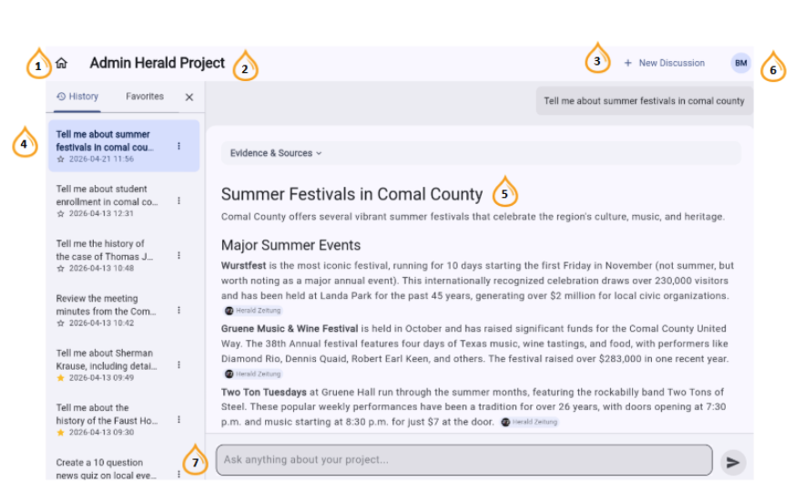
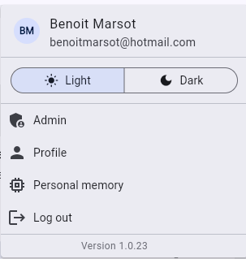
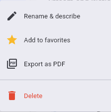

# Discover User Interface Guide

This page walks through the main Discover screen, the user control panel, and the options available on each discussion in the left menu.

## Main screen

*Screenshot placeholder — annotated main screen (callouts 1–7 below).*

1. **Home button** — returns you to the Discover home screen.
2. **Project name** — the project where your queries and response library are stored. Each user has their own, based on username and password.
3. **New discussion** — start a new topic thread.
4. **Query history** — a list of past discussions. Queries can be favorited, which shows a star in the index and lists them under the **Favorites** tab.
5. **Query response field** — where content, links, and data are returned to you.
6. **Individual user controls** — see [Individual user controls](#individual-user-controls) below.
7. **Query entry field** — where you type your question.

## Individual user controls

*Screenshot placeholder — user control panel.*

The user control panel lets you modify your interface and manage your account.

1. **Light and Dark** — switch the interface between black-on-white and white-on-black text.
2. **Admin** — depending on your role, opens user, outlet, announcement, and feedback tools. See [LiquidAmber administration](admin.md).
3. **Profile** — change your displayed name or password and view your account details. See [Profile, password, and account access](account-and-password.md).
4. **Personal memory** — manage facts you want the assistant to remember, scoped globally or to a specific project. See [Using personal memory](personal-memory.md).
5. **Log out** — closes your session. Your queries and history are preserved and will appear the next time you log in.

## Left menu options

*Screenshot placeholder — three-dot menu on a discussion.*

Accessed through the three dots to the right of each discussion, these options let you organize and share your queries and results.

1. **Auto-catalog** — currently in development, for improved query organization.
2. **Rename & describe** — by default, the first question of each thread is used as its title. Rename and describe a discussion for better sorting and faster retrieval.
3. **Add to favorites** — marks a discussion for faster retrieval through the **Favorites** tab in the left menu.
4. **Export as PDF** — exports an entire discussion, including questions, answers, and references, to a single PDF file for easy review, distribution, and sharing.
5. **Delete** — removes the discussion.

See also: [Getting Started with Discover](discover-getting-started.md) and [Research Trails & Response Tools](discover-research-trails.md).
