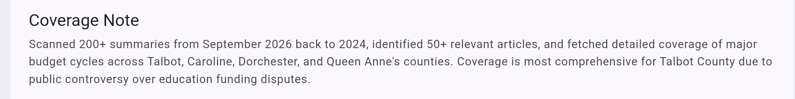
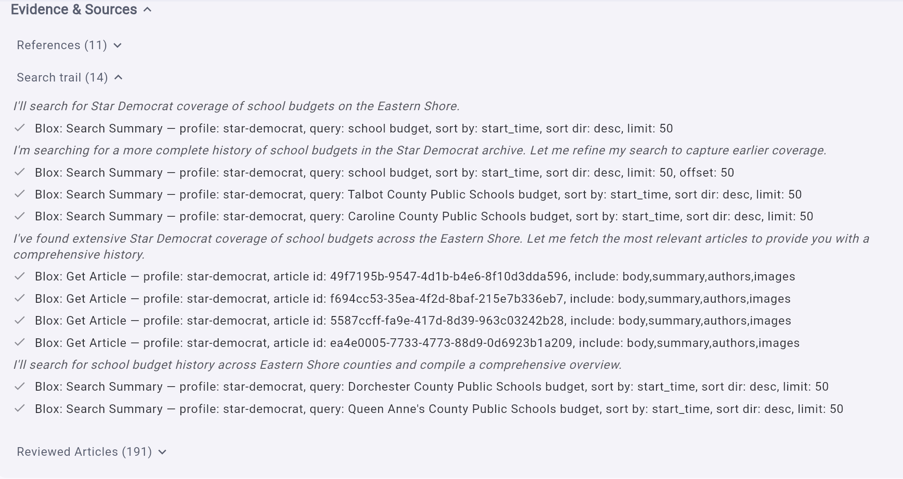
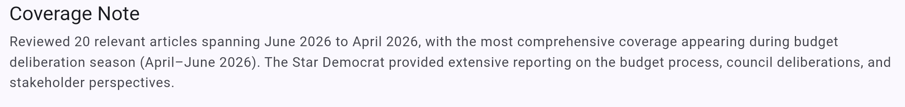
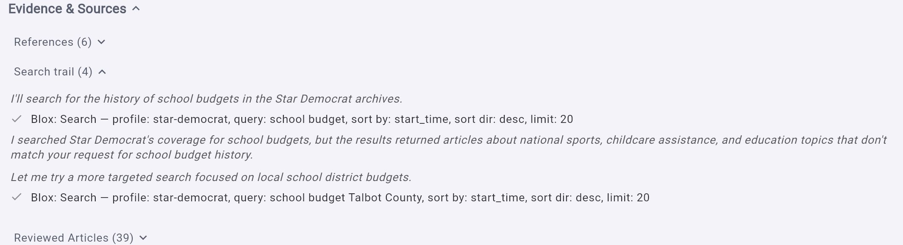

# Deep Archive Search: Journalist Guide

## Purpose

Deep Archive Search is designed for questions that may require reviewing a broad archive without loading every full article at once.

It separates discovery from evidence gathering:

1. Scan compact article summaries across a wider result set.
2. Identify every article that materially relates to the question.
3. Fetch those full articles one at a time.
4. Write the answer from the full reporting.

This improves recall while keeping the model's working context under control.

## Standard Research Versus Deep Archive Search

| | Standard Research | Deep Archive Search |
|---|---|---|
| Initial tool | `blox_search` | `blox_search_summary` |
| Initial result | JSON containing full article content | RSS containing headlines and summaries |
| Normal page size | 20 articles | 50 summaries |
| Full article retrieval | Included in the search result | Separate `blox_get_article` call |
| Selection process | Reviews the full articles returned by search | Reviews summaries first, then builds a relevant-article queue |
| Context use | Higher per search result | Lower during discovery |
| Best fit | Narrow or straightforward searches | Timelines, backgrounders, broad topics, and archive research |

The normal prompt is unchanged. Projects continue using it unless they are explicitly configured for the `discover/local/2steps` prompt flavor.

## How Deep Archive Search Works

### Step 1: Summary discovery

The assistant searches the publication archive with `blox_search_summary`.

Each result contains enough information for triage:

- Headline
- Article summary or excerpt
- Publication date
- Author
- Article URL
- Image URL, when available
- A stable `articleId`

The first page normally contains 50 summaries. Additional pages use offsets of 50 while relevant coverage continues to appear.

The assistant uses short keyword searches because BLOX is a keyword search, not a semantic search. Spaces act like `AND`, so a long natural-language question can become too restrictive. Date limits are sent through the date fields rather than placed in the search text.

### Step 2: Relevance review

The assistant deduplicates the summary results by `articleId` and decides which articles materially help answer the question.

An article is relevant when it contributes at least one of the following:

- A directly responsive fact
- A meaningful event or decision in the timeline
- A distinct viewpoint, consequence, or local impact
- Evidence that confirms or contradicts another article
- Names, dates, amounts, quotations, or records needed for the answer

There is no fixed top-three or top-ten cutoff. Every materially relevant article is added to the fetch queue.

### Step 3: Full article retrieval

The assistant calls `blox_get_article` for each relevant `articleId`.

Full articles are fetched sequentially, not in parallel. Before every fetch, the assistant checks whether the conversation is nearing its context limit. This prevents a group of large article bodies from overflowing the available context at once.

After each successful fetch, the assistant records the completed article and removes it from the pending queue. The same article is not fetched twice in one answer.

### Step 4: Answer and sourcing

The final answer is based on the fetched full articles, not only on the summaries. Summaries are used to decide what to retrieve, while full articles provide the evidence for detailed factual claims.

The answer keeps the same newsroom-oriented structure as the normal prompt, including:

- Verified facts
- Supporting sources
- Remaining uncertainties
- People to contact
- Records to obtain
- Possible reporting angles
- Inline source chips and a complete source list

## What Happens Near the Context Limit

If the system warns that the context is nearing its limit, the assistant stops all additional searches and article fetches.

It then:

1. Answers from the full articles already retrieved.
2. Reports how many summaries were scanned.
3. Reports how many relevant articles were identified and fetched.
4. Reports how many relevant articles remain pending.
5. Offers to resume the pending queue without fetching completed articles again.
6. Continues searching farther back in time only after the pending queue is complete.

Unfetched summaries may describe the remaining coverage, but they should not support detailed factual claims.

## What Journalists Will Notice

A Deep Archive Search answer may take more tool calls than a Standard Research answer because relevant articles are retrieved individually. In return, it can inspect a broader set of candidates before spending context on full text.

The Coverage Note should make the process visible. A completed answer may say:

> Scanned 100 summaries from May 2026 to September 2026, identified 12 relevant articles, and fetched all 12 full articles.

If retrieval stops early, it may say:

> Scanned 100 summaries, identified 12 relevant articles, fetched 8, and left 4 pending for continuation.

## When to Use Each Prompt

Use Standard Research when:

- The question is narrow and likely answered by a small number of stories.
- Speed matters more than a broad archive sweep.
- The newest 20 full results are likely to contain the answer.

Use Deep Archive Search when:

- Building a timeline or backgrounder
- Researching a topic across months or years
- Looking for all meaningful coverage of a person, organization, project, or issue
- A search may return many loosely related stories
- Missing an older but important article would materially weaken the answer

## Example

For a question such as "How did the downtown redevelopment plan develop, and what remains unresolved?":

Standard Research searches a page of full articles and begins synthesis from those results.

Deep Archive Search first scans up to 50 compact summaries, pages farther if relevant coverage continues, identifies the articles that mark decisions and changes in the project, retrieves each relevant full article sequentially, and then writes the timeline from the complete fetched evidence.

## What Does Not Change

Both prompts:

- Treat the local publication as the primary source for local reporting.
- Use the same publication profile and outlet variables.
- Follow the same keyword and date-filter rules.
- Require source-backed factual claims.
- Preserve the same citation, carousel, and follow-up components.
- Use external search only when local coverage is absent, incomplete, or the user asks for broader context.

## Configuration Note

A project using this workflow must:

- Select the `discover/local/2steps` prompt flavor.
- Allow the `blox_search_summary` tool.
- Allow the `blox_get_article` tool.
- Have working BLOX CMS credentials for full article retrieval.

Existing projects using `discover/local/normal` continue to use the original Standard Research behavior.

## Example result from Deep Archive Search

### Evidence and sources

_look at the number of review articles with the current normal discover_

## Example with Standard Research

### Evidence and sources
_look at the number of review articles with the current normal discover_

## comparison

| Workflow | Reviewed articles | References used | Span |
|---|---:|---:|---|
| Normal | 39 | 6 | **3 months** |
| Deep Archive Search | 191 | 11 | **2 years** |