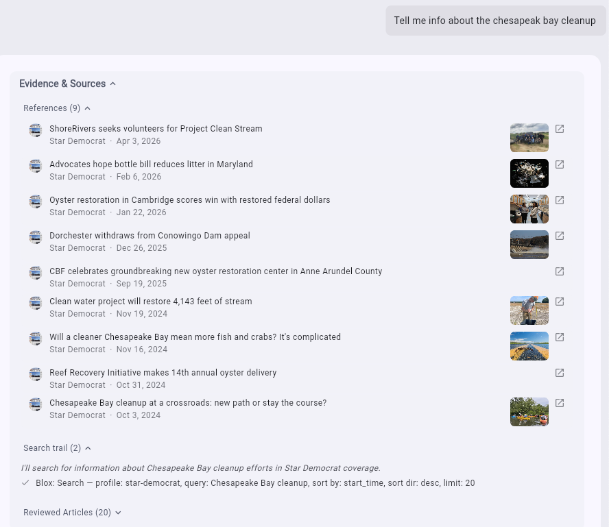
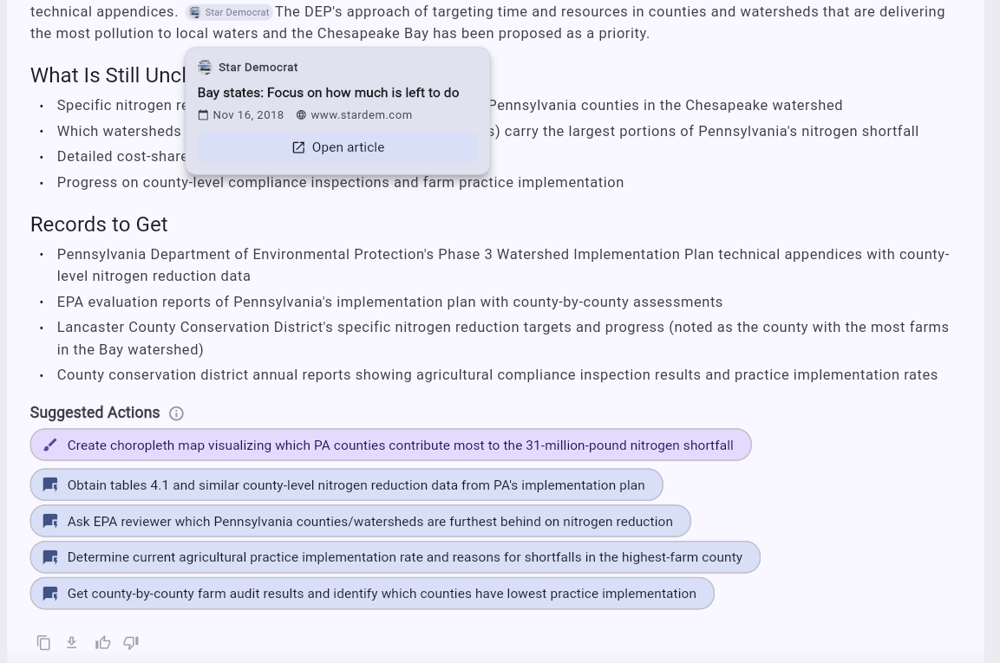

# Research Trails & Response Tools

Every Discover response is built to be checked. This page covers how sourcing is shown, and the tools available on each response.

## Clear research trails

Each query response, along with individual in-line links to specific stories, includes full sourcing that reflects the articles reviewed as well as those directly referenced. This gives reporters a clear research trail for validation.

*Screenshot placeholder — Evidence & Sources panel.*

- **References** — displays all of the articles used to create the response. These articles were read, reviewed, and determined to be relevant to the query.
- **Search trail** — shows all of the actions performed by the assistant and the justification for them.
- **Reviewed articles** — displays all of the articles that were read and reviewed before a response was returned.

## Next steps and feedback

*Screenshot placeholder — response with citations, suggested actions, and feedback tools.*

1. Each fact presented is supported by in-line information about its source material, including the original story headline, publication name, date, and a direct link.
2. If photos are associated with the original stories, they're displayed in the response. Each image can be downloaded for re-use or reference.
3. Suggested actions can also include a call to **LiquidAmber Describe**, which creates a shareable graphic and links out to the embedded Q&A widget on the publisher's site. See [Describe](describe.md).
4. Discover prompts you with **suggested actions** relevant to the current discussion, so you can keep going without composing a new query from scratch.
5. Each response includes tools to help you use it: copy the response, download it as Markdown (.md), and give **thumbs up** or **thumbs down** feedback on the quality of the response.

See also: [Getting Started with Discover](discover-getting-started.md) and [User Interface Guide](discover-interface.md).
