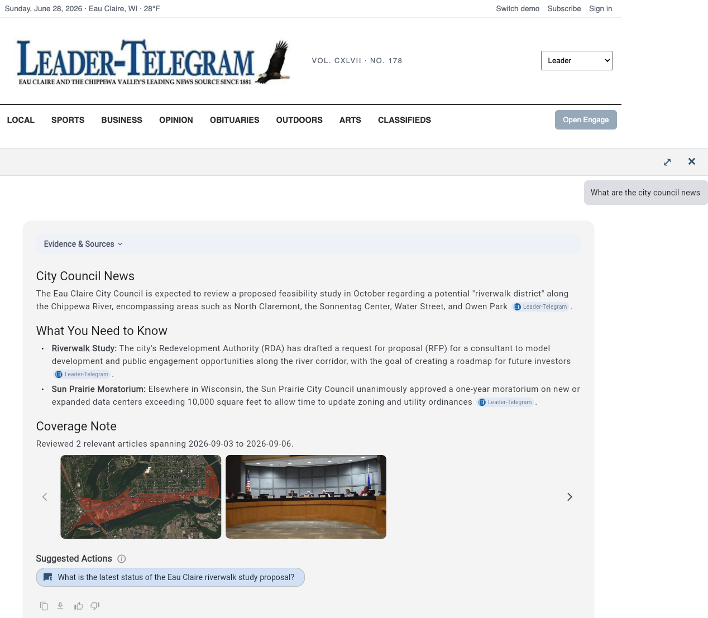

# Engage

## Overview

LiquidAmber Engage brings LiquidAmber's research and verification capabilities to public audiences. Publishers embed Engage on their own site to offer readers cited Q&A directly on top of their own reporting, built on the same sourced, cited answer engine that powers Discover.

## What it does

- Lets readers ask questions and get answers grounded in a publisher's own reporting and content.
- Keeps citations and links visible so readers can see the source behind an answer.
- Summarizes how much coverage backs an answer (how many articles were reviewed and the date range they span), with any related photos shown alongside it.
- Suggests relevant follow-up questions so a reader can keep exploring a topic without typing a new query.
- Runs as an embeddable widget that publishers control, without giving up editorial control over the underlying content.
- Adapts to the host page's colors and fonts, so it reads as part of the site rather than a bolted-on tool.

## 1. Embedding on a page

*Screenshot placeholder, inline embedded Engage search field on a publisher page.*

Engage is delivered as a single custom element, `<liquidamber-engage>`, loaded through a small script tag. A publisher can present it in either of two modes:

- **Embedded mode** (default): the widget sits directly in the page layout, for example a search field placed above an article or in a sidebar. A reader types a question and taps **Ask** without leaving the page.
- **Overlay mode** (coming soon): a publisher-chosen element, such as an "Open Engage" button in a header or nav bar, opens the widget as a panel over the page. This gives a publisher a single, site-wide entry point.

Both modes call the same backend and produce the same answer experience once a question is asked.

## 2. Asking a question and getting an answer

*Screenshot placeholder, embedded answer panel with evidence, coverage note, and suggested actions.*

Once a reader submits a question, Engage returns an answer the same way a Discover response is built, grounded in the publisher's own content, with the sourcing kept visible instead of hidden behind the text.

## 3. Evidence & Sources

Every answer sits behind an expandable **Evidence & Sources** panel:

- **References**: the specific articles the answer draws from, shown as clickable citations inline in the answer text.
- **Search trail**: the steps taken to research the question.
- **Reviewed Articles (Coverage Note)**: a short summary of how many articles were reviewed and the date range they span (for example, "Reviewed 2 relevant articles spanning 2026-09-03 to 2026-09-06"), with a scrollable carousel of any photos tied to those articles.

## 4. Suggested Actions

Below the answer, Engage lists **Suggested Actions**, follow-up questions related to the current topic, so a reader can keep going without composing a new question from scratch.

## 5. Answer tools

Each answer carries a small toolbar:

- **Copy**: copies the answer text to the clipboard.
- **Download**: saves the answer as a Markdown (.md) file.
- **Thumbs up / thumbs down**: lets a reader rate the answer, optionally with a short reason, so a publisher can track answer quality.

## 6. Matching the publisher's look

Engage is built to disappear into a publisher's own design rather than stand out as a third-party widget:

- `inherit-theme` infers colors and fonts straight from the host page's own styles.
- A theme override (a `data-theme` attribute, or a page-level theme object) lets a publisher set explicit colors and fonts when more control is needed than automatic inheritance provides.
- The widget carries no LiquidAmber branding of its own; it presents as part of the publisher's site.

## 7. Setup

Turning Engage on for an outlet is an administrative task, not something a reader configures:

- An outlet admin supplies the partner identifier, site key, and backend API URL, and maintains the list of domains allowed to embed the widget. See [Configure Engage security](admin-outlets.md#configure-engage-security).
- A publisher's engineering team adds the `<liquidamber-engage>` element and its loader script to the page(s) where Engage should appear, choosing embedded or overlay mode and, for overlay mode, the element that should trigger it.
- The widget's assets can be preloaded in the background so there's no delay the first time a reader opens it.
