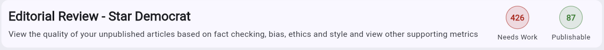
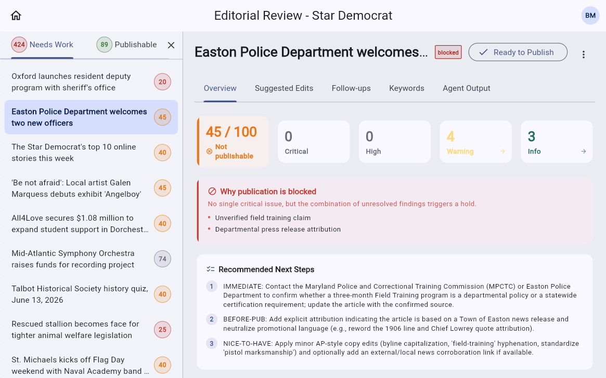
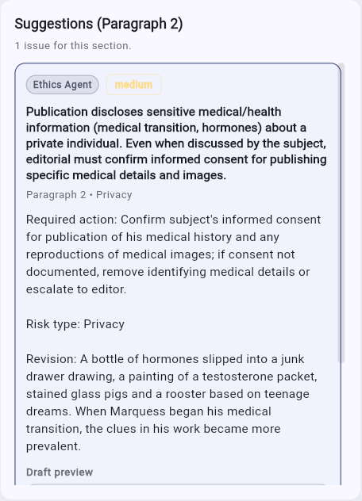
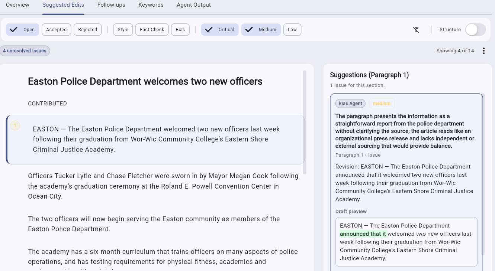
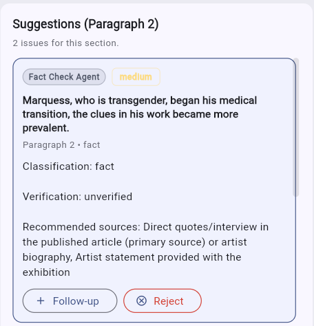
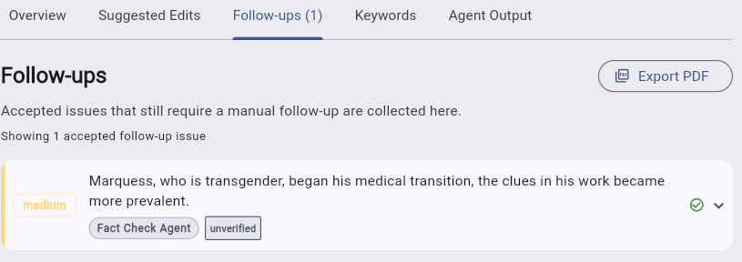
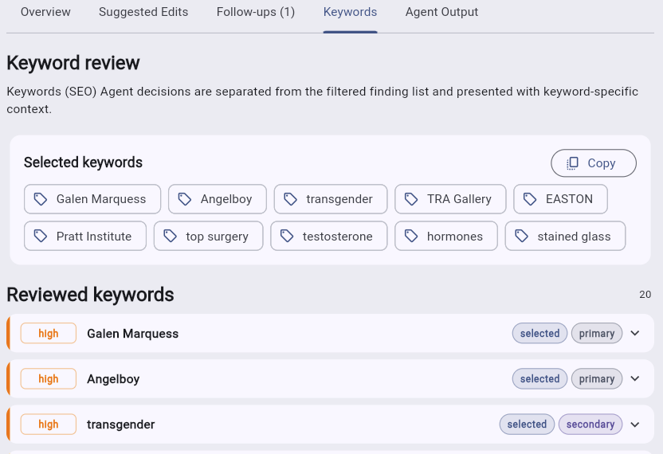
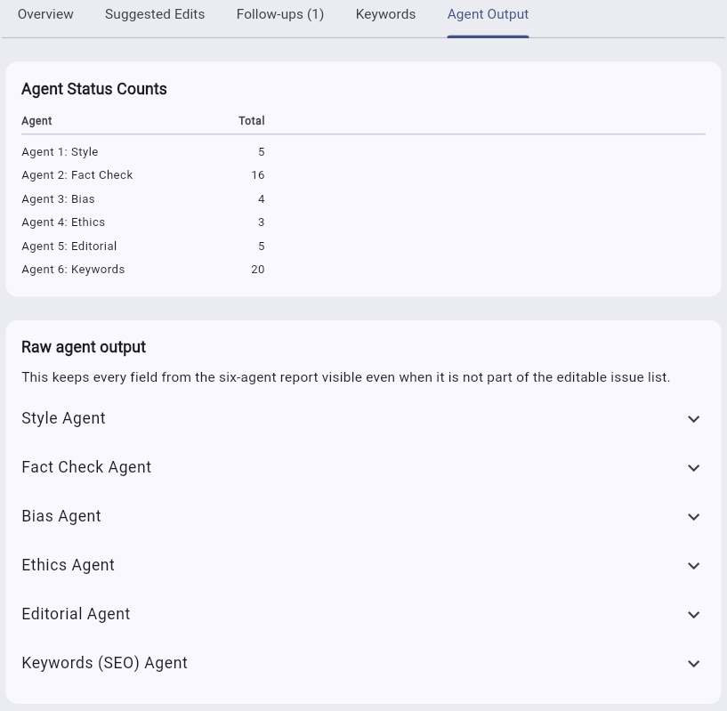

# Verify

## Overview

LiquidAmber Verify is an editorial verification workflow for reviewing claims, evidence, and citations before publication.

Six agents review every submitted article: Style, Fact Check, Bias, Ethics, Editorial, and Keywords (SEO). Their findings are combined into a single score and a set of actionable suggestions, follow-ups, and keyword recommendations that an editor works through before marking the article ready to publish.

## What it does

- Lets editors and journalists inspect the claims in an article alongside the evidence and sources behind them.
- Surfaces citation and evidence trails so reviewers can confirm a claim is supported before it goes to print.
- Supports outlet-scoped review, so access to articles and evidence is limited to authorized profiles.

## 1. Editorial Review dashboard

The dashboard for an outlet (e.g. "Editorial Review - Star Democrat") shows two counters at a glance:

- **Needs Work** - number of unpublished articles that still have unresolved issues.
- **Publishable** - number of articles that have cleared review and are ready to go out.

## 2. Article list and score

Selecting the outlet opens a two-pane view:

- The **left panel** lists every unpublished article with a badge showing its current score out of 100 (lower scores indicate more unresolved issues).
- The **right panel** (Overview tab) shows the selected article's full review summary:
  - The score out of 100 and a readiness badge such as **Not publishable**, plus a **blocked** tag next to the title when publication is held.
  - Counts by severity: **Critical**, **High**, **Warning**, **Info**.
  - A **Why publication is blocked** panel that explains, in plain language, which unresolved findings are triggering the hold (for example, an unverified field-training claim or missing attribution).
  - A **Recommended Next Steps** checklist, ordered by priority: **Immediate** (must confirm before anything else), **Before-pub** (must fix before publishing), and **Nice-to-have** (optional polish).
  - A **Ready to Publish** control that becomes available once the blocking issues are resolved.

## 3. Suggestions panel

Clicking into a paragraph opens its **Suggestions** panel, labeled with the paragraph number and a count of issues for that section (e.g. "Suggestions (Paragraph 2) - 2 issues for this section").

Each suggestion card shows:

- The agent that raised it (e.g. **Fact Check Agent**) and a severity pill (**low**, **medium**, **high**, **critical**).
- The paragraph number and finding type (e.g. "Paragraph 2 - fact").
- The flagged text or claim, its **Classification** (fact, opinion, etc.), and its **Verification** status (e.g. **unverified**).
- **Recommended sources** the editor can use to confirm or refute the claim.
- Two actions:
  - **+ Follow-up** - accepts the issue and sends it to the Follow-ups tab for manual resolution (use this when the claim needs outside confirmation before the article can ship).
  - **Reject** - dismisses the finding as not applicable.

## Decide how to handle a finding

Review the flagged text, explanation, evidence, and proposed revision before choosing an action. The controls record different editorial decisions:

- **Apply** changes the working article text to the proposed revision and accepts the finding. Review the draft preview first; applying a revision does not independently verify its factual content.
- **Accept** records that the finding is valid and requires action. It does not edit the article by itself and does not mean an unverified claim has become verified. Accepted findings with a required action, and accepted disputed or unverified Fact Check findings, appear in **Follow-ups**.
- **Reject** records that the finding is not applicable. Use it for an incorrect, duplicate, or irrelevant finding, not merely to remove a difficult issue from the open list.
- **Severity override** changes the editorial priority assigned to a finding. It does not alter the finding, evidence, verification status, or accept/reject decision.
- **Add comment** records the editor's evidence, rationale, or follow-up result. Comments help later reviewers understand why a decision was made.

In **Issue Explorer**, selection checkboxes let you apply Accept, Reject, or a severity override to several visible findings. Confirm the active filters and selected count before using a bulk action.

## 4. Suggested Edits tab

This tab lists every finding across the article as edit suggestions, with tools to work through them:

- **Status filters**: Open, Accepted, Rejected - track where each issue stands in the review.
- **Category filters**: Style, Fact Check, Bias (Ethics and Editorial findings also appear here when present).
- **Severity filters**: Critical, Medium, Low.
- A **Structure** toggle to switch the article view between prose and structural/outline display.
- A running count of unresolved issues (e.g. "4 unresolved issues") and how many are shown out of the total (e.g. "Showing 4 of 14").
- The **article body** on the left, with the paragraph tied to the currently selected suggestion highlighted.
- A **suggestion detail panel** on the right showing:
  - The agent and severity that raised it (e.g. **Bias Agent**, **medium**).
  - A description of the issue.
  - A suggested **revision** with a **draft preview** that shows the proposed replacement text inline, with the changed wording highlighted.

## 5. Follow-ups tab

Follow-ups collects every issue an editor accepted from the Suggestions panel but that still needs manual confirmation before the article can be considered resolved ("Accepted issues that still require a manual follow-up are collected here").

Each row shows:

- The severity pill and the flagged text.
- The originating agent (e.g. **Fact Check Agent**) and its status tag (e.g. **unverified**).
- A chevron to expand the full finding, add an editor comment, or change the review decision.

An **Export PDF** button lets you generate a shareable copy of the follow-up list, useful for looping in a reporter or a source for confirmation.

Use an editor comment to record what was checked and the resulting evidence. An accepted item remains in Follow-ups while its report still classifies it as requiring manual action, disputed, or unverified. Reject it only when the finding itself is not applicable.

## 6. Keywords tab

The Keywords tab separates the **Keywords (SEO) Agent**'s decisions from the rest of the findings and presents keyword-specific context for search optimization review:

- **Selected keywords** - the current set of chips chosen for the article, with a **Copy** button to copy them for use elsewhere (e.g. a CMS metadata field).
- **Reviewed keywords** - the full list considered by the agent (with a total count, e.g. "20"), each entry showing:
  - A confidence level (e.g. **high**).
  - The keyword or phrase.
  - Tags indicating whether it is **selected** or not, and whether it is a **primary** or **secondary** keyword for the article.

## 7. Agent Output tab

This tab is the raw, unfiltered view of everything the six agents produced:

- **Agent Status Counts** - a table with the total number of findings per agent: Style, Fact Check, Bias, Ethics, Editorial, and Keywords.
- **Raw agent output** - one collapsible section per agent, preserving every field from that agent's report even when a field isn't surfaced in the editable Suggested Edits, Follow-ups, or Keywords lists. Use this when you need the full context behind a finding or want to double-check what an agent actually returned.

## Typical editor workflow

1. Open the outlet's **Editorial Review dashboard** and pick an article from the **Needs Work** list.
2. Check the **Overview** tab to see the score, the blocking reasons, and the recommended next steps.
3. Work through **Suggested Edits**, filtering by status/category/severity, applying appropriate revisions, accepting valid findings, and rejecting only findings that are not applicable.
4. Send claims that need outside confirmation to **Follow-ups**, then record the result and evidence in an editor comment.
5. Review the **Keywords** tab to confirm the selected SEO keywords are accurate.
6. Use **Agent Output** if you need the full detail behind any finding.
7. Once all blocking issues are cleared, mark the article **Ready to Publish**.

Use [Export and share your work](export-and-share.md#export-from-verify) when a reporter, editor, or source needs a PDF of the review, filtered issues, or follow-ups.
